# The Yoga Spot - Yoga Studio Management Website
## WEB course 2024 - Part C

## Project Overview

"The Yoga Spot" is a website designed for a yoga studio that allows users to register, search for yoga classes based on various criteria, book places in classes, and manage their personal profiles. The website aims to improve the user experience for yoga practitioners and enable them to manage their yoga activities easily and conveniently.

The project includes a full implementation of the server side using Flask and MongoDB, addressing all requirements: proper directory structure, client request handling, database connection and queries, form implementation, and a complete user experience.

## Website Workflow

Here is the typical sequence of actions for a user on the website:

1. **Visit the Homepage** - The user arrives at the homepage and is exposed to information about the studio and navigation options.
2. **Register/Login** - A new user registers or an existing user logs in.
3. **Search for Classes** - The user searches for suitable yoga classes using various filters.
4. **Book a Class** - Selection of an appropriate class and booking a spot.
5. **Profile Management** - View and update personal details, view existing bookings and cancel future bookings if necessary.
6. **Send Inquiries** - Use the "Contact Us" form for inquiries and questions.
7. **View Additional Information** - Browse information pages such as class types, studio locations, and more.
8. **Logout** - Exit the system and return to the homepage.

## Website Pages and Functionality

### Homepage
The homepage displays general information about the studio, atmosphere images, and an introduction to the experience offered by the studio. The page includes quick links to different sections of the website.

### Registration Page
Allows new users to register with their personal details. The form includes validation and requires acceptance of the terms of use and privacy policy through a popup window, allowing the user to read the terms before approval.

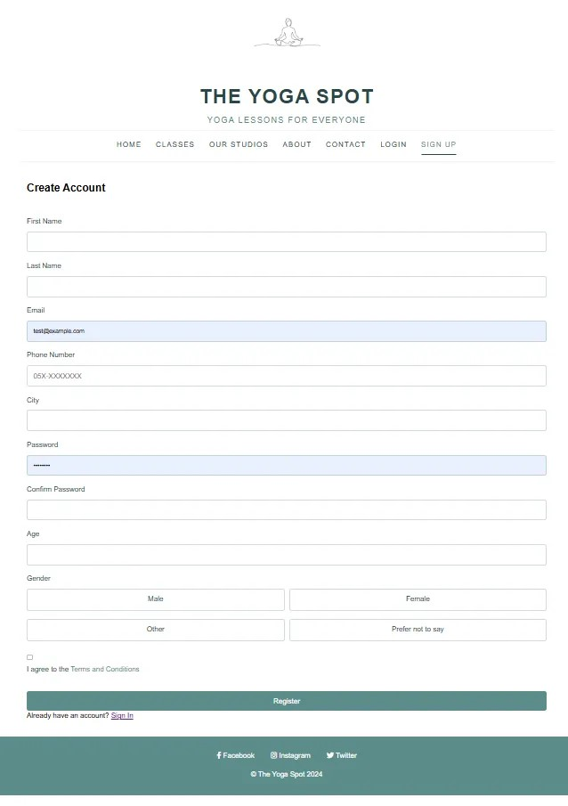
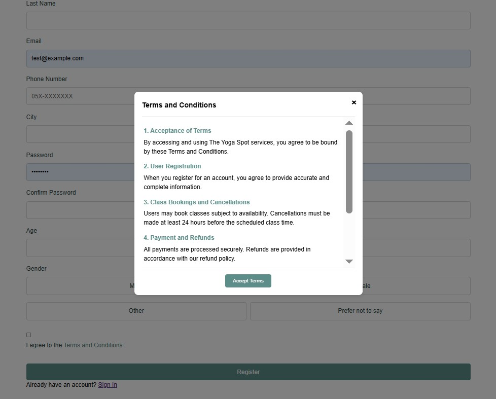

### Login Page
Allows registered users to log in to their account using email and password.

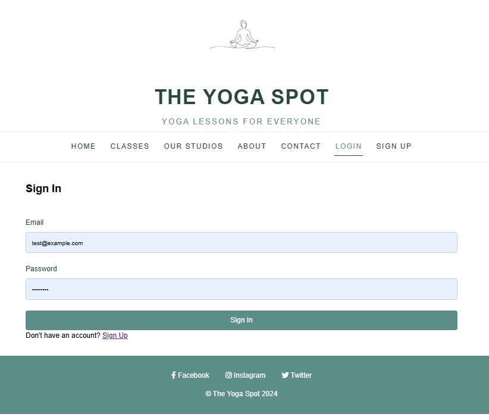

### Class Search Page
A central page that allows users to search for classes based on a variety of criteria: class type, level, time, location, and instructor. Results are displayed in a convenient format and allow for easy booking.

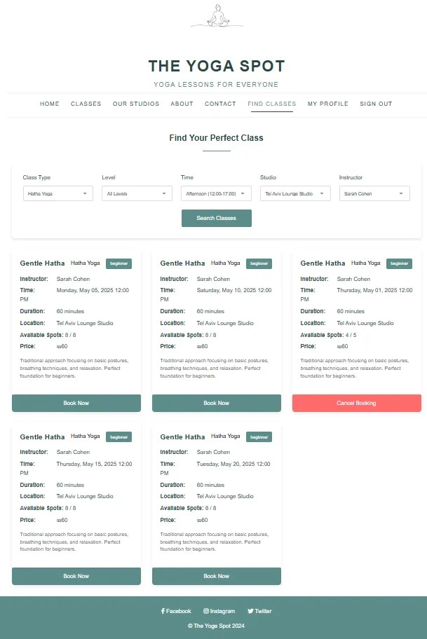

### Profile Page
Displays the user's personal details, allows editing them, and includes a list of their class bookings. Users can view their history and cancel future bookings. Additionally, users can view all inquiries made through the "Contact Us" form and delete previous inquiries.

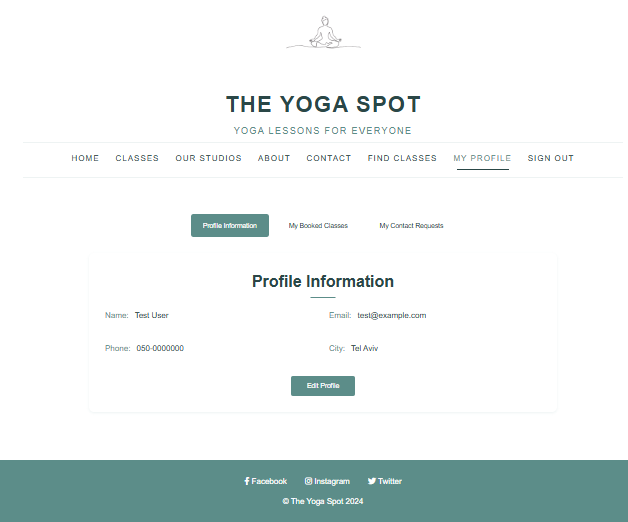
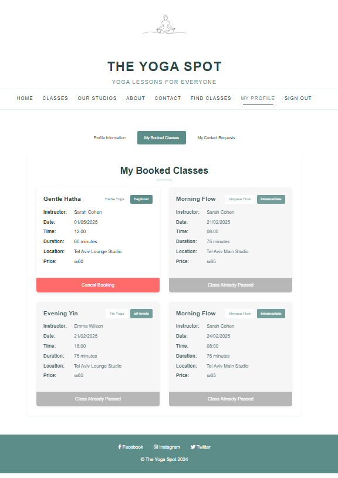
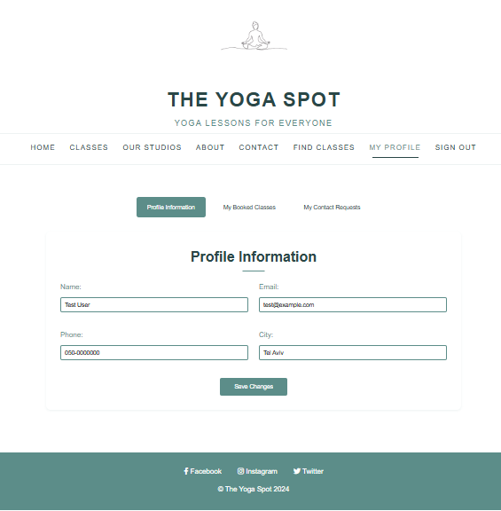

### Contact Us Page
Allows users to send messages and questions to the studio through a contact form. Inquiries are saved in the system and can be viewed through the profile page.

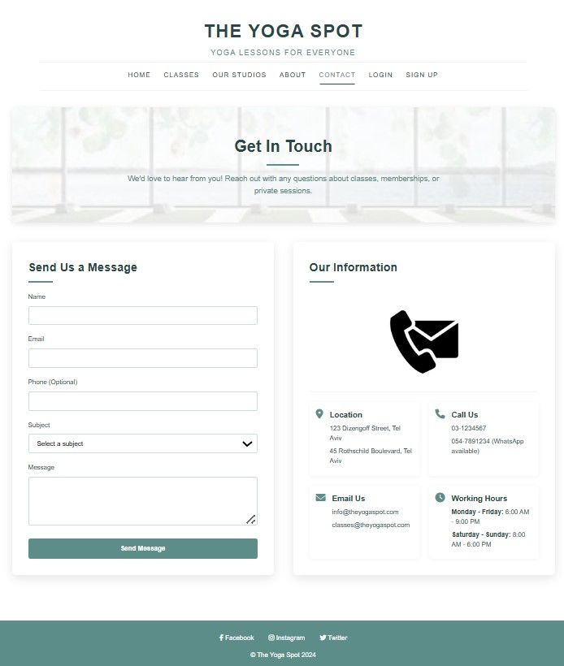

### Class Types Page
Displays detailed information about all types of classes offered at the studio, including description, difficulty levels, benefits, and images.

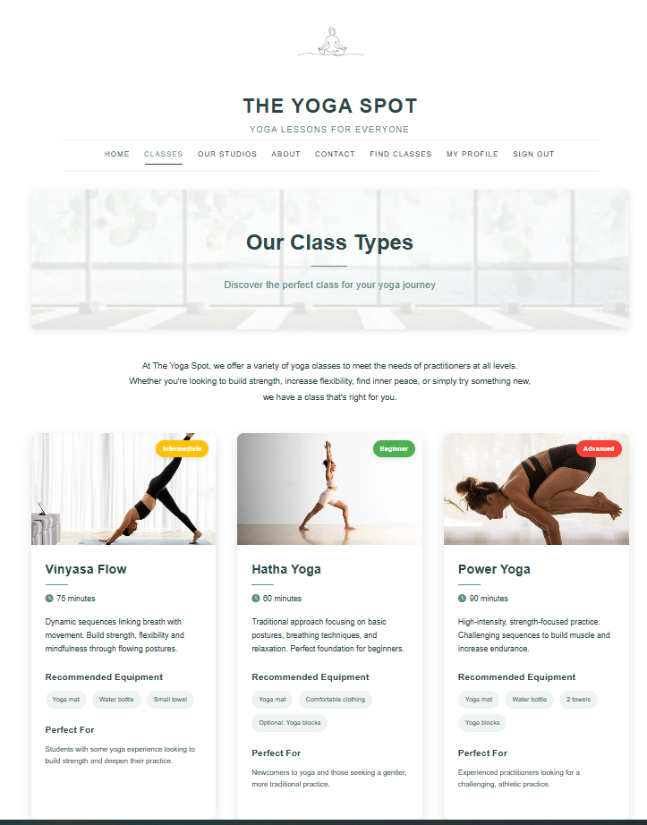
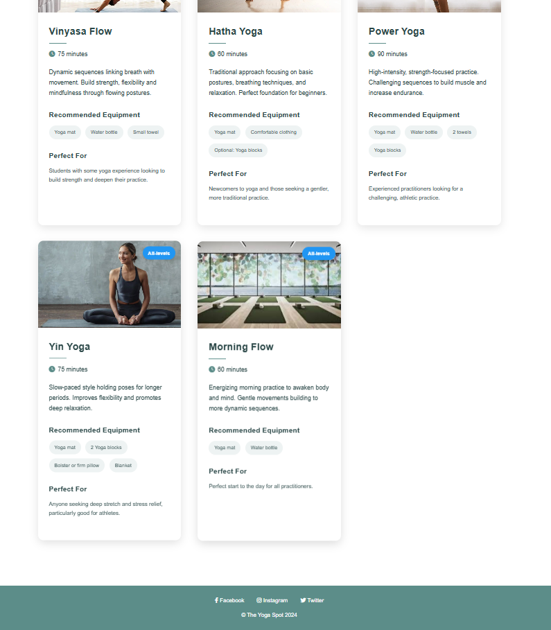

### Studio Page
Displays the various studio locations, including addresses, contact details, maps, and operating hours.

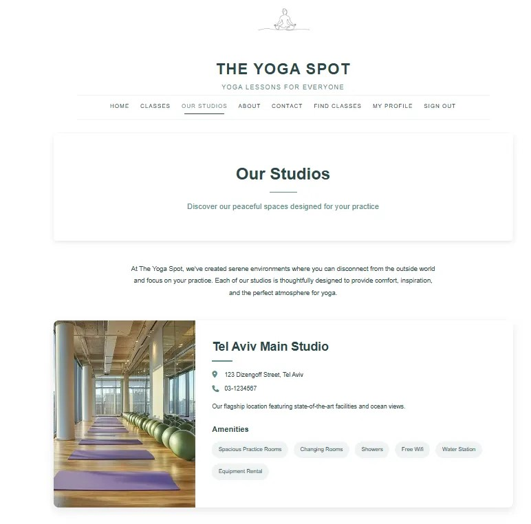
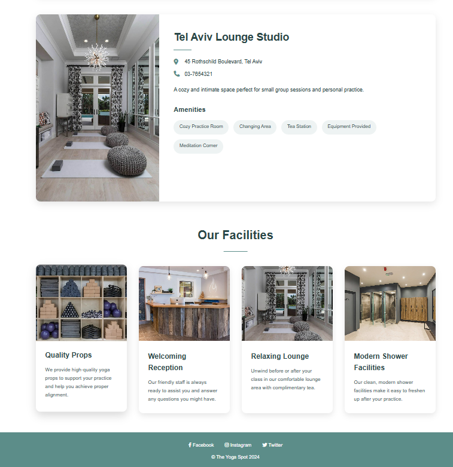

### About Page
Provides information about the studio, its history, instructors, and the philosophy that guides it.

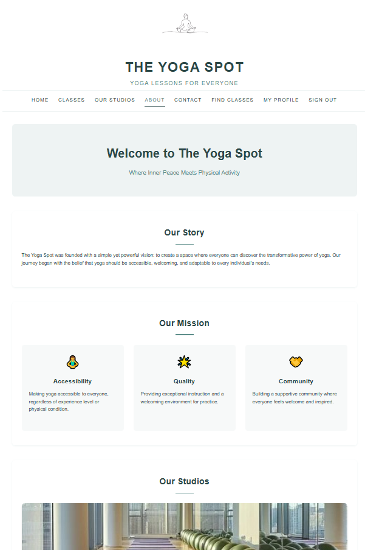

### Logout
Allows users to safely log out of the system and return to the homepage.

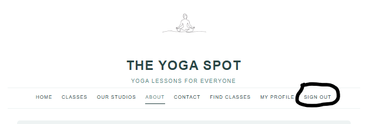

## Technical Implementation

The website was developed in a Python/Flask environment with support for:
- Responsive design using HTML5, CSS3, and JavaScript
- MongoDB database for storing information about users, classes, and bookings
- Server-side authentication and validation for information security
- Support for profile image uploads
- Use of templates for displaying dynamic content